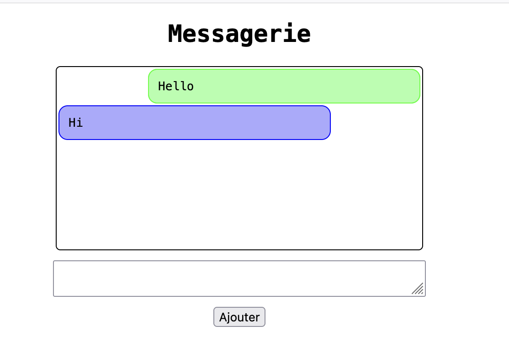

# Messagerie

## Description
Une application simple de messagerie permettant d'envoyer et d'afficher des messages dans une interface web interactive.

## Fonctionnalités
- **Envoyer un message** : L'utilisateur peut taper un message dans une zone de texte et l'ajouter à l'affichage grâce au button **Ajouter**.
- **Afficher un message** : Le message ajouté s'affiche dans la zone d'affichage avec des styles alternés (droite et gauche).

## Aperçu du projet



## Installation et utilisation
1. Clonez ce dépôt :
   ```bash
   git clone https://github.com/dongorias/tp-messagerie.git
   ```
2. Ouvrez le fichier `index.html` dans votre navigateur.

## Structure du projet
- `index.html` : Le fichier HTML principal contenant la structure de l'application.
- `styles.css` : La feuille de style pour personnaliser l'apparence de l'application.
- `script.js` : Le fichier JavaScript gérant la logique de l'application.

## Améliorations futures
- Ajouter une fonctionnalité pour supprimer des messages.
- Permettre la personnalisation des styles de message (choix des couleurs, des bordures, etc.).
- Enregistrer les messages dans le stockage local pour une conservation persistante.

---
